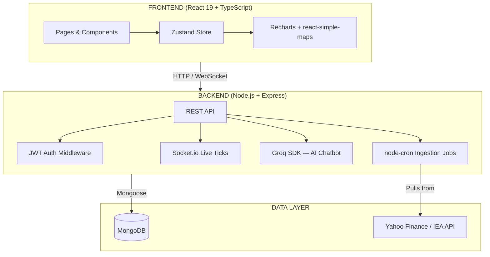

<div align="center">


<p>
  
  
  
  
  
  
</p>
<p>
  
  
  
  
  
  
</p>
<p>
  
  
  
</p>

<br/>

A real-time intelligence platform that tracks global energy markets, geopolitical conflicts, and sustainability progress — built for transparency and actionable insight.

<br/>

</div>

---

## What This Is

Energy crises don't happen in a vacuum. A war, a trade sanction, a blocked shipping route — each one sends shockwaves through global energy markets, and the countries that suffer most are rarely the ones causing the disruption. This platform makes those connections visible.

It pulls live and historical energy price data, maps it against geopolitical conflict events, tracks how different countries are progressing on clean energy transitions, and lets you ask plain-English questions about any of it through an AI assistant.

---

## Demo

📹 **[Watch Demo Video](https://drive.google.com/file/d/1DJk9Roy-ZhMjQtU9EeWLpeWFJuMoe5RS/view?usp=sharing)**

---

## Live Preview

| Page | What It Shows |
| :--- | :--- |
| **Dashboard** | WTI crude and natural gas price timeseries, SDG progress bars, a rotating globe with conflict markers |
| **Prices** | Live commodity charts (WTI, Brent, Natural Gas, Coal) with forecast overlays |
| **Map** | World heatmap switchable between energy price index, import dependency, and renewable share — with per-country price breakdowns on hover |
| **Supply** | Supply chain disruption events and their impact scores |
| **Trends** | Renewable vs fossil fuel adoption curves with conflict shock markers |
| **AI Terminal** | A domain-restricted chatbot that only answers energy and sustainability questions |

---

## Why It Exists

Most energy data platforms are either locked behind paywalls, too technical for non-specialists, or simply don't connect the dots between conflict events and clean energy progress. This project is an attempt to build something that does all three in one place:

- **Correlate** — see how a conflict event in one region ripples into price changes globally
- **Track** — monitor each country's fossil fuel dependency and renewable energy share over time
- **Measure** — ground everything against SDG 7 (Affordable & Clean Energy) and SDG 13 (Climate Action) targets
- **Query** — ask the AI assistant anything about the data in plain language

---

## Tech Stack

### Frontend
| Tool | Version | Why |
| :--- | :--- | :--- |
| React | 19.x | UI framework |
| TypeScript | 6.x | Type safety across the entire frontend |
| Vite | 8.x | Build tool and dev server |
| Tailwind CSS | 4.x | Utility-first styling with the HUD terminal theme |
| Zustand | 5.x | Lightweight global state (energy prices, selected country, map mode) |
| Recharts | 3.x | Price timeseries, area charts, volatility overlays |
| react-simple-maps | 3.x | SVG world map for the heatmap feature |
| D3 | 7.x | Custom color interpolation and geo projections |
| Lucide React | Latest | Icon set used throughout the UI |
| Framer Motion | 12.x | Animations |

### Backend
| Tool | Version | Why |
| :--- | :--- | :--- |
| Node.js | 18+ | Runtime |
| Express.js | 4.x | REST API framework |
| MongoDB + Mongoose | 8.x | Primary datastore with schema validation |
| JWT + bcryptjs | — | Authentication and password hashing |
| Socket.io | 4.x | Live price tick broadcasting |
| node-cron | 4.x | Scheduled data ingestion from IEA and Yahoo Finance |
| Groq SDK | 0.4+ | Powers the AI chatbot (model: `llama-3.3-70b-versatile`) |
| Joi | 17.x | Request validation |
| Multer | — | CSV file uploads for manual data ingestion |

---

## Features

### Real-Time Energy Prices
Live polling from the backend every 5 seconds. WTI crude, Brent crude, natural gas, coal, and electricity prices update in-place with a regression-based forecast overlay on the chart.

### Interactive World Heatmap
Three switchable visualisation modes on the same map:
- **Energy Price Index** — countries coloured from dark navy (cheapest energy) through teal, amber, orange, to deep red (most expensive)
- **Import Dependency** — exporters shown in emerald green, heavy importers in red
- **Renewable Share** — a green intensity scale from 0% to 100%

Hovering any country shows a tooltip with its crude oil, natural gas, electricity, and coal prices, an energy score bar, renewable share, and conflict risk rating. Clicking opens a full sidebar with all metrics.

### Geopolitical Conflict Tracker
A registry of conflict events (Russia-Ukraine, Red Sea disruption, Middle East tensions) each tagged with an impact score and linked to corresponding price changes.

### AI Assistant
A chatbot backed by Groq's `llama-3.3-70b-versatile` model. It has a hardcoded system prompt focused on energy and sustainability, and a keyword filter on the backend — so it won't go off-topic. Runs with a 128k context window. The interface matches the HUD terminal design of the rest of the app.

### SDG Progress Tracking
Per-country progress on SDG 7 (Clean Energy) and SDG 13 (Climate Action), with bar charts and year-over-year trend data pulled from IEA and BP datasets.

### Auth & Role-Based Access
JWT access tokens (15m expiry) + refresh tokens (7d expiry). Two roles: `ADMIN` and `ANALYST`. Admin can trigger data ingestion jobs and upload CSV files manually.

---

## Architecture



**Data flow:** `node-cron` pulls from IEA/Yahoo Finance on a schedule → validates and transforms → writes to MongoDB → REST API serves the frontend → Socket.io broadcasts live price ticks → the AI chatbot receives the system context and answers domain-specific questions.

---

## Project Structure

```
energy-crisis-sustainability-tracker/
├── backend/
│   ├── src/
│   │   ├── config/           # env.js, db.js
│   │   ├── middleware/        # auth, error handling, validation
│   │   ├── models/            # Mongoose schemas (User, EnergyPrice, Conflict, etc.)
│   │   ├── routes/            # auth, energy-prices, supply, conflicts, chatbot, admin...
│   │   └── validators/        # Joi request validators
│   ├── uploads/               # CSV files for manual ingestion
│   ├── .env                   # (not committed — see .env.example)
│   └── package.json
│
├── frontend/
│   ├── src/
│   │   ├── components/
│   │   │   ├── maps/          # EnergyMap, SvgGlobe, RotatingGlobe
│   │   │   └── ui/            # Navbar, TopTicker, HudPanel, KPICard...
│   │   ├── pages/             # Home, Prices, Supply, Trends, Map, Chatbot
│   │   ├── store/             # energyStore.ts (Zustand)
│   │   ├── lib/               # data.ts (country profiles), utils.ts
│   │   └── App.tsx
│   ├── .env                   # VITE_API_URL=http://localhost:5001
│   └── vite.config.ts
│
├── docs/
│   ├── ARCHITECTURE_BLUEPRINT.md
│   └── API_CATALOG.md
│
└── docker-compose.yml
```

---

## API Reference

Base URL: `http://localhost:5001/api`

### Auth
| Method | Endpoint | Description | Auth |
| :--- | :--- | :--- | :--- |
| `POST` | `/auth/register` | Create a new account | Public |
| `POST` | `/auth/login` | Login, receive JWT + refresh token | Public |
| `POST` | `/auth/refresh` | Rotate access token using refresh token | Public |
| `POST` | `/auth/logout` | Invalidate refresh token | Public |
| `GET` | `/auth/me` | Get current user profile | 🔒 |

### Energy Prices
| Method | Endpoint | Description | Auth |
| :--- | :--- | :--- | :--- |
| `GET` | `/energy-prices` | Historical prices (filter: iso3, commodity, date range) | 🔒 |
| `GET` | `/energy-prices/latest` | Most recent price snapshot for all commodities | 🔒 |
| `GET` | `/energy-prices/live` | Current live tick (WTI, Brent, Natural Gas) | 🔒 |
| `GET` | `/energy-prices/:iso3/trend` | Price trend for a specific country | 🔒 |

### Supply & Conflicts
| Method | Endpoint | Description | Auth |
| :--- | :--- | :--- | :--- |
| `GET` | `/supply/disruptions` | Active supply chain disruption events | 🔒 |
| `GET` | `/supply/dependencies` | Country-level fossil fuel import dependency | 🔒 |
| `GET` | `/conflicts` | All geopolitical conflict events | 🔒 |
| `GET` | `/conflicts/:id` | Single conflict event with price impact data | 🔒 |

### Renewables & Forecasting
| Method | Endpoint | Description | Auth |
| :--- | :--- | :--- | :--- |
| `GET` | `/renewables/compare` | Renewable vs fossil adoption by country | 🔒 |
| `GET` | `/forecast/:iso3/:commodity` | Price forecast for a country-commodity pair | 🔒 |

### AI Chatbot
| Method | Endpoint | Description | Auth |
| :--- | :--- | :--- | :--- |
| `POST` | `/chatbot/ask` | Send a question, receive an AI response | Public |
| `GET` | `/chatbot/suggestions` | Get suggested starter questions | Public |

### Admin
| Method | Endpoint | Description | Auth |
| :--- | :--- | :--- | :--- |
| `POST` | `/admin/upload` | Upload a CSV for manual data ingestion | 🔒 ADMIN |
| `POST` | `/admin/ingest/iea` | Trigger IEA data pull | 🔒 ADMIN |
| `GET` | `/admin/ingestion-jobs` | Check ingestion job status | 🔒 ADMIN |

### Realtime
| Protocol | Endpoint | Description |
| :--- | :--- | :--- |
| WebSocket | `/ws/prices` | Subscribes to live price tick stream |

---

## Getting Started

### Requirements
- Node.js v18+
- MongoDB v7+ (local or Atlas)
- A Groq API key (get one free at [console.groq.com](https://console.groq.com))
- Docker (optional, for containerised setup)

### Manual Setup

```bash
# 1. Clone the repo
git clone https://github.com/your-username/energy-crisis-sustainability-tracker.git
cd energy-crisis-sustainability-tracker

# 2. Backend
cd backend
cp .env.example .env
# Fill in MONGODB_URI and GROQ_API_KEY in .env
npm install
npm run dev
# Runs on http://localhost:5001

# 3. Frontend (new terminal)
cd frontend
# Create .env with:  VITE_API_URL=http://localhost:5001
npm install
npm run dev
# Runs on http://localhost:5173
```

### Docker

```bash
docker-compose up --build
```

### Environment Variables

**Backend (`backend/.env`)**
```env
PORT=5001
MONGODB_URI=mongodb://127.0.0.1:27017/energy_crisis_tracker
JWT_ACCESS_SECRET=your_access_secret
JWT_REFRESH_SECRET=your_refresh_secret
JWT_ACCESS_EXPIRES_IN=15m
JWT_REFRESH_EXPIRES_IN=7d
GROQ_API_KEY=your_groq_api_key
EIA_API_KEY=your_eia_api_key
CORS_ORIGINS=http://localhost:5173
```

**Frontend (`frontend/.env`)**
```env
VITE_API_URL=http://localhost:5001
```

---

## Data Models

### EnergyPrice
```
commodity    String   (wti_crude | brent_crude | natural_gas | coal | electricity)
price        Number
unit         String   (USD/bbl | USD/MMBtu | USD/tonne | USD/kWh)
date         Date
source       String   (IEA | YahooFinance | Manual)
iso3         String   (optional country filter)
```

### ConflictEvent
```
title        String
region       String
startDate    Date
endDate      Date (optional)
impactScore  Number   (0–100)
commodities  [String] (affected commodities)
priceEffect  Number   (% change correlated)
```

### User
```
email        String (unique)
passwordHash String
role         String  (ANALYST | ADMIN)
createdAt    Date
lastLogin    Date
```

---

## SDG Alignment

**SDG 7 — Affordable and Clean Energy**
Tracked through renewable share per country, fossil fuel import dependency ratios, and electricity price affordability scores. The platform highlights countries falling behind the 2030 targets.

**SDG 13 — Climate Action**
Tracked through the conflict-to-clean-energy disruption correlation — specifically, how geopolitical events interrupt renewable energy supply chains and delay transitions away from fossil fuels.

---

## Design System

The entire frontend uses a **HUD terminal aesthetic** — dark backgrounds, monospace type, cyan accents, and corner-bracket decorations throughout. The design language is consistent across all six pages and was built from scratch with Tailwind CSS v4.

Key reusable components:
- `HudPanel` — the base card with corner brackets and a top accent line
- `TopTicker` — the scrolling live price bar fixed at the top of every page
- `Navbar` — floating bottom navigation with active-state highlighting
- `EnergyMap` — the composable world map with three heatmap modes

<div align="center">
<br/>
Built with purpose — for the planet 🌍
<br/><br/>

</div>
